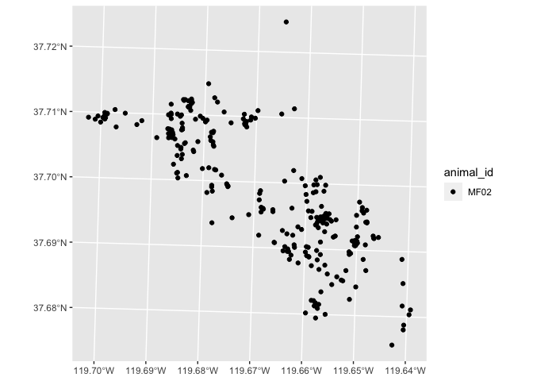

<!-- README.md is generated from README.Rmd. Please edit that file -->

# beastr

<!-- badges: start -->
<!-- badges: end -->

**B**etter **E**nvironment/**A**nimal **S**ensor **T**elemetry
**R**epository

“Better” as in “better than nothing”. There are many other solutions
that are more developed than this, most notably
[Movebank](https://www.movebank.org/)

The goal of beastr is to provide a framework for storing, accessing, and
processing wildlife telemetry data.

## Installation

You can install the package using the
[devtools](https://devtools.r-lib.org/) package

``` r
devtools::install_github('rgzn/beastr')
```

## Example

Build your database:

``` r
library(beastr, quietly = TRUE)
library(sf, quietly = TRUE)
#> Linking to GEOS 3.10.2, GDAL 3.4.1, PROJ 7.2.1; sf_use_s2() is TRUE

# Use example source data
fix_file = system.file("lotek/33452.txt", package = "beastr")
device_file = system.file("deployment/devices.csv", package = "beastr")
animal_file = system.file("deployment/animals.csv", package = "beastr")
deploy_file = system.file("deployment/deployments.csv", package = "beastr")
myDB = paste0(tempdir(check = TRUE), "/", "example.gpkg")

# Build a database
build_database(fix_files = fix_file,
               device_files = device_file,
               animal_files = animal_file,
               deployment_files = deploy_file,
               dsn = myDB,
               tz = "US/Pacific")
#> Rows: 20 Columns: 6
#> -- Column specification --------------------------------------------------------
#> Delimiter: ","
#> chr  (3): AnimalID, Start_Method, Stop_Method
#> dbl  (1): DeviceID
#> dttm (2): In_Service, Out_Service
#> 
#> i Use `spec()` to retrieve the full column specification for this data.
#> i Specify the column types or set `show_col_types = FALSE` to quiet this message.
#> Deleting source `C:\Users\JWEISS~1\AppData\Local\Temp\1\RtmpGK0x1E\example.gpkg' failed
#> Writing layer `fixes' to data source 
#>   `C:\Users\JWEISS~1\AppData\Local\Temp\1\RtmpGK0x1E\example.gpkg' using driver `GPKG'
#> Writing 468 features with 14 fields and geometry type Point.
#> Deleting layer `devices' failed
#> Writing layer `devices' to data source 
#>   `C:\Users\jweissman\AppData\Local\Temp\1\RtmpGK0x1E\example.gpkg' using driver `GPKG'
#> Writing 33 features with 7 fields without geometries.
#> Deleting layer `animals' failed
#> Writing layer `animals' to data source 
#>   `C:\Users\jweissman\AppData\Local\Temp\1\RtmpGK0x1E\example.gpkg' using driver `GPKG'
#> Writing 17 features with 5 fields without geometries.
#> Deleting layer `deployments' failed
#> Writing layer `deployments' to data source 
#>   `C:\Users\jweissman\AppData\Local\Temp\1\RtmpGK0x1E\example.gpkg' using driver `GPKG'
#> Writing 20 features with 6 fields without geometries.

# What layers are in there?
sf::st_layers(myDB)
#> Driver: GPKG 
#> Available layers:
#>     layer_name geometry_type features fields              crs_name
#> 1        fixes         Point      468     14 WGS 84 / UTM zone 11N
#> 2 animal_fixes         Point      462     12 WGS 84 / UTM zone 11N
#> 3      devices            NA       33      7                  <NA>
#> 4      animals            NA       17      5                  <NA>
#> 5  deployments            NA       20      6                  <NA>
```

View data linked to animals, rather than sensors:

``` r
library(dplyr, quietly = TRUE)
#> 
#> Attaching package: 'dplyr'
#> The following objects are masked from 'package:stats':
#> 
#>     filter, lag
#> The following objects are masked from 'package:base':
#> 
#>     intersect, setdiff, setequal, union
library(ggplot2, quietly = TRUE)

points = sf::st_read(myDB, layer = "animal_fixes")
#> Reading layer `animal_fixes' from data source 
#>   `C:\Users\jweissman\AppData\Local\Temp\1\RtmpGK0x1E\example.gpkg' 
#>   using driver `GPKG'
#> Simple feature collection with 462 features and 12 fields (with 160 geometries empty)
#> Geometry type: POINT
#> Dimension:     XY
#> Bounding box:  xmin: 261780.2 ymin: 4173114 xmax: 267257.4 ymax: 4178607
#> Projected CRS: WGS 84 / UTM zone 11N

points %>% 
  ggplot2::ggplot() + 
  ggplot2::geom_sf(ggplot2::aes(fill = animal_id))
```



## Related Projects

-   ctmmweb \[<https://github.com/ctmm-initiative/ctmmweb>\]
-   collardb \[<https://github.com/kissmygritts/collardb>\]
-   amt \[<https://github.com/jmsigner/amt>\]
-   movebank \[<https://www.movebank.org/>\]

## TODO

-   integrate with `{amt}` (use amt tools)
-   integrate with movebank (export/import)
-   add new readers as new devices are used
-   use `{golem}` for the shiny app stuff
